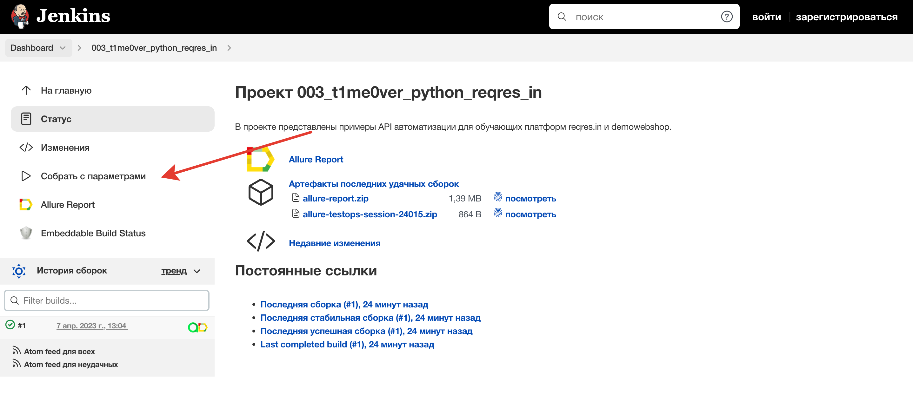
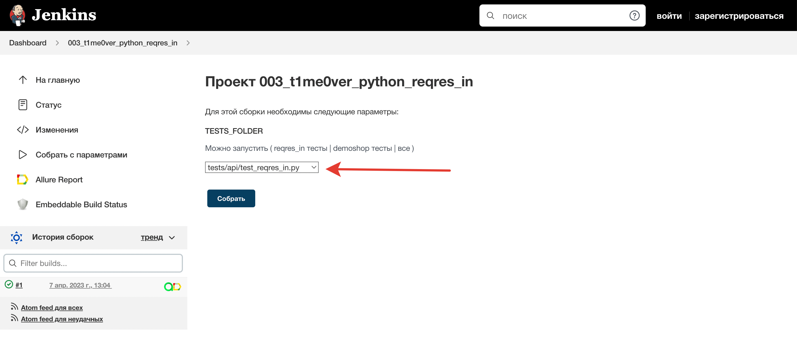
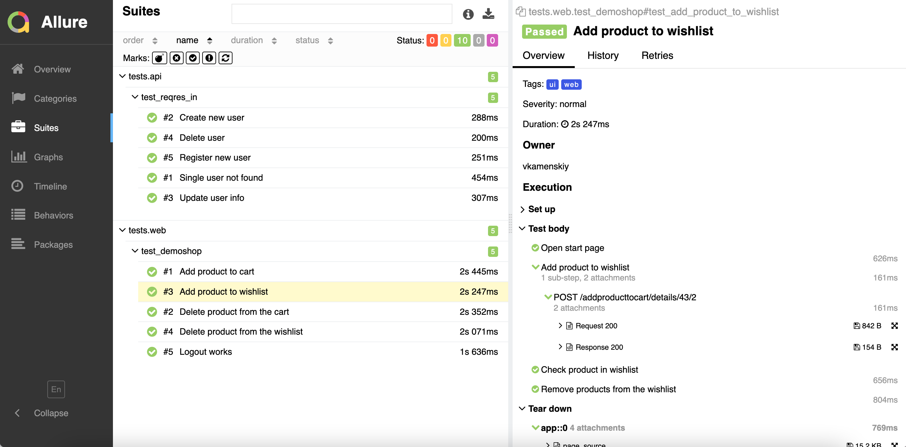
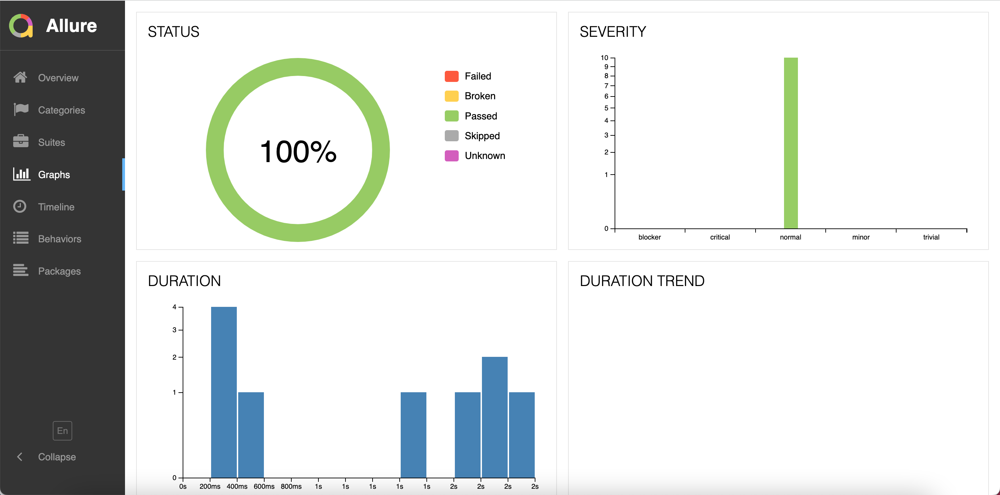
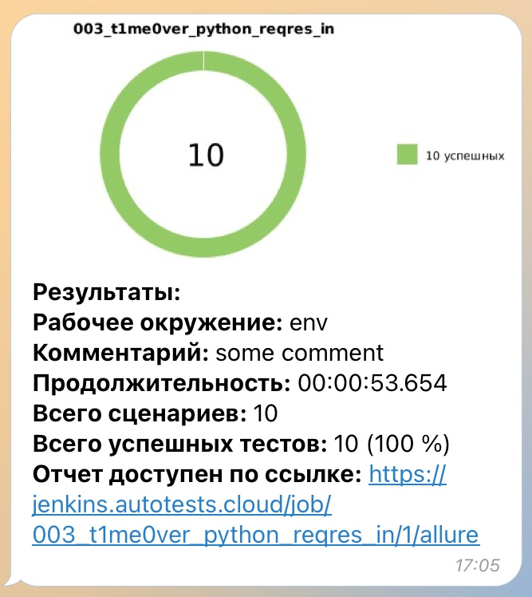
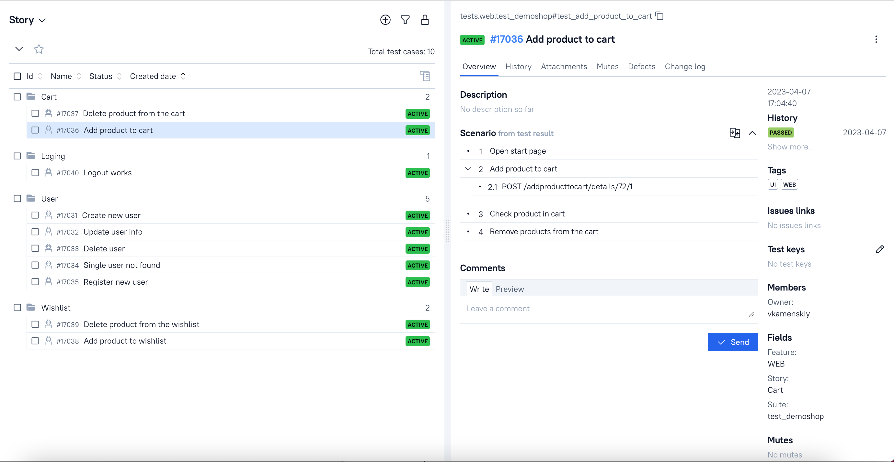
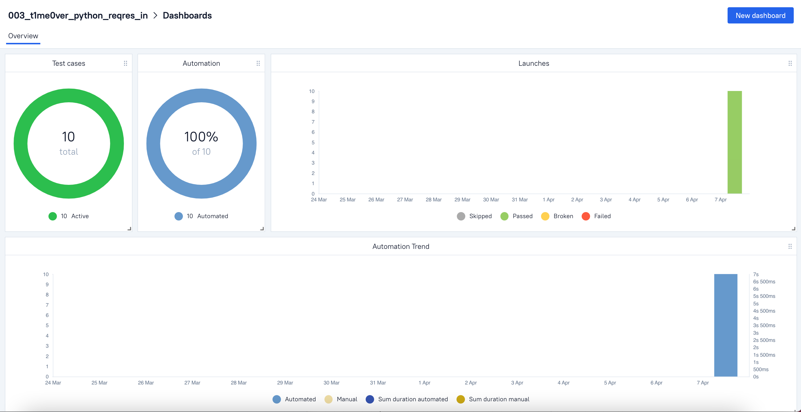

## Проект API автотестов для учебных платформ reqres.in и demowebshop

<!-- Описание -->

## :open_book: Описание
В проекте представлены примеры API и UI автоматизации тестирования на Python. 
<p>API тесты на платформе reqres.in
<p>WEB тесты  на платформе demowebshop - демонстрация гибридных тестов WEB и API (авторизация через API)
<p>Подключена система отчетности Allure Reports с вложениями (логи, скриншоты, видео, etc). 
<p>В UI-тестах шаги отображены в виде лямбда-степов через with allure.step
<p>Также по факту прохождения теста отправляется уведомление с результатами в Telegram.
<p>Браузер в UI-тестах запускается удаленно в Selenoid.
<p>Реализована интеграция с Allure TestOps.

## :heavy_check_mark: Кратко
- [x] API тесты
- [x] Гибридные тесты
- [x] Параметризованный запуск тестов
- [x] Логирование
- [x] Запуск WEB тестов, используя `Jenkins` и `Selenoid`
- [x] `Allure Reports` с вложениями (логи, скриншоты, видео)
- [x] Интеграция с `Allure TestOps`
- [x] Отправка результатов тестирования в `Telegram`

<!-- Технологии -->

## :gear: Используемые технологии
<p  align="center">
  <code></code>
  <code></code>
  <code></code>
  <code></code>
  <code></code>
  <code></code>
  <code></code>
  <code></code>
  <code></code>
  <code></code>
  <code></code>
  <code></code>
<!--   <code></code> -->
  <code></code>
</p>


<!-- Тест кейсы -->

## :heavy_check_mark: Что проверяют API тесты

- [x] Создание нового пользователя
- [x] Обновление пользователя
- [x] Удаление пользователя
- [x] Регистрация нового пользователя
- [x] Поиск пользователя которого нет

## :heavy_check_mark: Что проверяют WEB тесты
- [x] Добавление товара в корзину
- [x] Удаление товара из корзины
- [x] Добавление товара в список желаемого
- [x] Удаление товара из списка желаемого
- [x] Выход из аккаунта

<!-- Jenkins -->

##  Запуск тестов из [Jenkins](https://jenkins.autotests.cloud/job/003_t1me0ver_python_reqres_in/)

Для запуска тестов из Jenkins:
1. Нажмите кнопку "Собрать с параметрами"

<p></p>

2. Выберите параметры

<p></p>

3. Нажмите "Собрать"

<!-- Локальный запуск -->

## :computer: Локальный запуск 

1. Склонируйте репозиторий
2. Установите Poetry `poetry install`
3. Откройте проект в PyCharm, установите интерпретатор
4. Создайте `.env` файл по образцу в папке проекта
5. Запустите тесты в PyCharm или в командной строке (не забудьте подставить нужные параметры):
```bash
pytest --env={ENV} --alluredir allure-results/
```

### :heavy_plus_sign: Параметры сборки

> - ENV - окружение (демонстрационный параметр, рабочий только "prod") - prod, test, local

<!-- Отчеты -->

## :bar_chart: Отчеты о прохождении тестов доступны в Allure

> При локальном запуске введите в командной строке: 
```bash
allure serve 
```

###  Allure

#### Примеры отображения тестов



#### Во вкладке Graphs можно посмотреть графики о прохождении тестов, по их приоритезации, по времени прохождения и др.



###  Telegram

Настроена отправка отчета в Telegram



<!-- Allure TestOps -->

## :briefcase: Проект интегрирован с Allure TestOps 

#### Во вкладке со сьютами, мы можем:
- Управлять всеми тест-кейсами или с каждым отдельно
- Перезапускать каждый тест отдельно от всех тестов
- Настроить интеграцию с Jira
- Добавлять ручные тесты и т.д



#### Представлены дашборды аналитики


